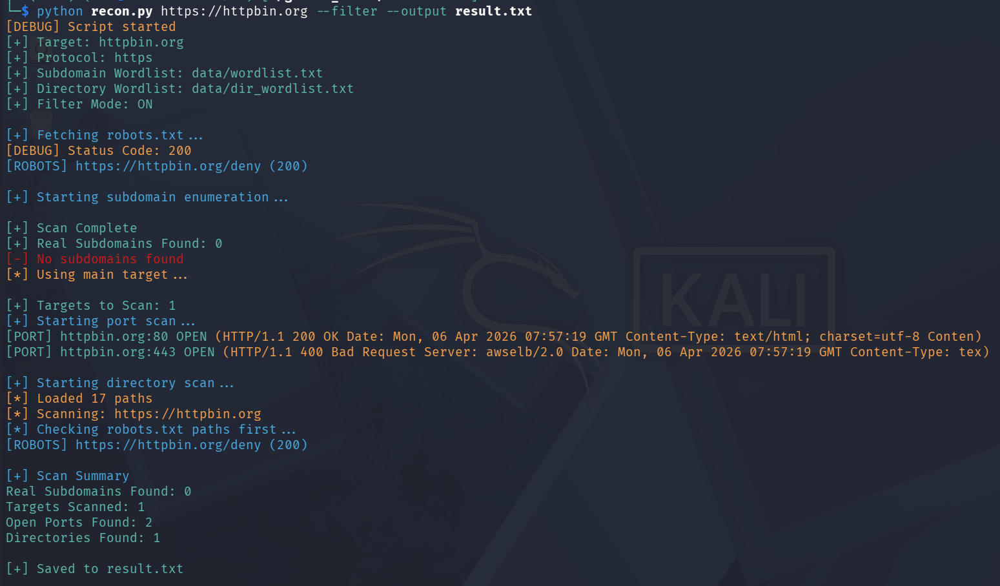

🔍 Smart Recon

A Python-based reconnaissance automation tool for performing structured information gathering on target domains.

💡 Why Smart Recon?

Unlike many heavy and complex recon tools, Smart Recon is designed with simplicity and clarity in mind.

- 🧠 Built from scratch – no external recon frameworks used
- 🧩 Modular architecture – easy to extend and maintain
- ⚡ Lightweight & fast – minimal dependencies
- 🎯 Beginner-friendly – clean and understandable codebase
- 🛠️ Customizable – supports custom wordlists
- 🧹 Clean output – filter mode removes noise
- 🛑 Interrupt-safe – handles Ctrl + C gracefully

❓ Why Choose Smart Recon?

Smart Recon is not designed to replace advanced recon frameworks —
it is built to simplify and demonstrate how reconnaissance works internally.

You should use this tool if you want:

- 📖 A clear and readable implementation of recon techniques
- 🧠 To learn how real recon tools work under the hood
- 🛠️ A lightweight tool for quick testing
- 🎯 A beginner-friendly project to study and extend
- 🧩 A solid base to build your own advanced recon tool

Instead of being feature-heavy, Smart Recon focuses on clarity, structure, and learning value.

🚀 Features

- 🔎 Subdomain Enumeration
- 🌐 Port Scanning (80, 443)
- 📂 Directory Bruteforcing
- 🤖 robots.txt Parsing
- 🎯 Filter Mode (clean output)
- 💾 Save results to file
- ⚡ Safe interruption (Ctrl + C support)

🧠 What I Learned

This project reflects my understanding of how real-world reconnaissance tools are designed.

- 🧩 Designing modular Python architecture
- ⚙️ Handling edge cases (timeouts, invalid targets)
- 🚦 Implementing graceful interruption handling
- 📊 Managing and filtering large outputs
- 🔍 Understanding practical reconnaissance workflows
- 🛠️ Writing clean and maintainable code

🎯 Future Improvements

- 🔗 Add multi-threading for faster scans
- 🌍 Expand port scanning coverage
- 📡 Integrate API-based subdomain enumeration
- 📊 Export results (JSON/CSV)
- 🖥️ Build a web-based interface

⚙️ Installation

git clone https://github.com/thenullroot/smart-recon.git

cd smart-recon

python3 -m venv venv

source venv/bin/activate

pip install -r requirements.txt

🧪 Usage

Basic scan:

python recon.py https://example.com

Filter output:

python recon.py https://example.com --filter

Custom wordlists:

python recon.py https://example.com --subs subdomains.txt --dirs directories.txt

Save results:

python recon.py https://example.com --output result.txt

## 📸 Screenshot

⚠️ Disclaimer

This tool is intended for educational and authorized testing purposes only.
Do not use it on systems without permission.

👨‍💻 Author

GitHub: https://github.com/thenullroot

LinkedIn: https://www.linkedin.com/in/aniket-nayak-634495317/
